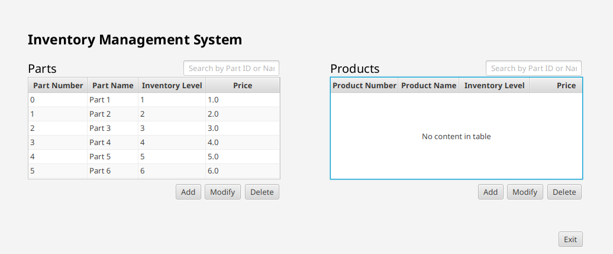

<h3 align="center">Parts Management Application</h3>

  

    Made for the course "Software 1 - C482" at WGU
  

  
  

    Products can be associated with parts and inventory stock can be managed.
    Parts will not be able to be deleted if they are associated with products as an extra precaution.
    

